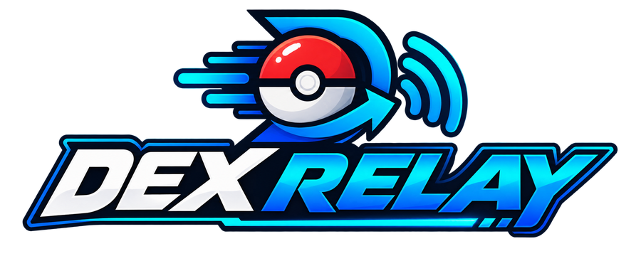
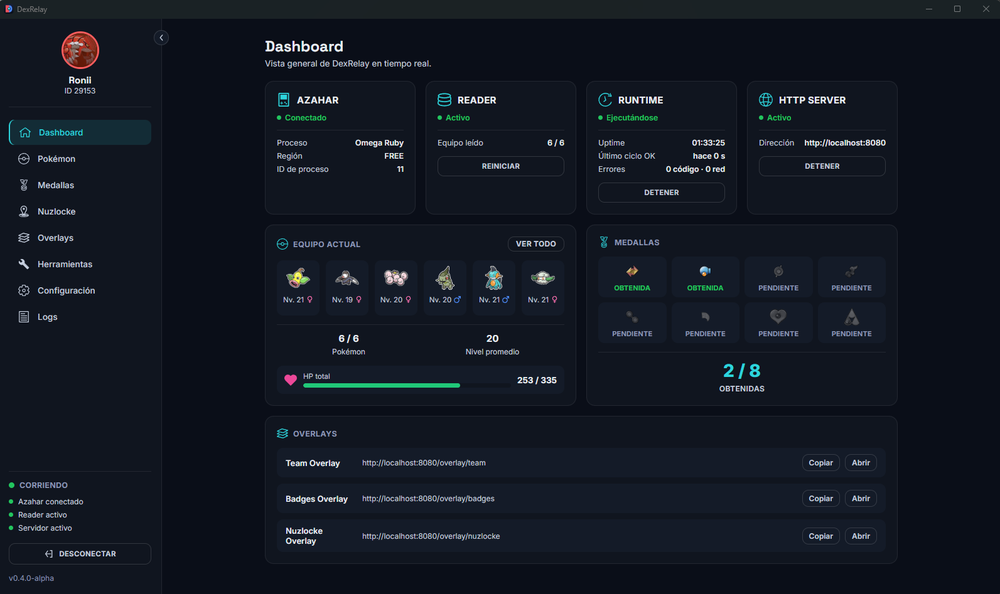
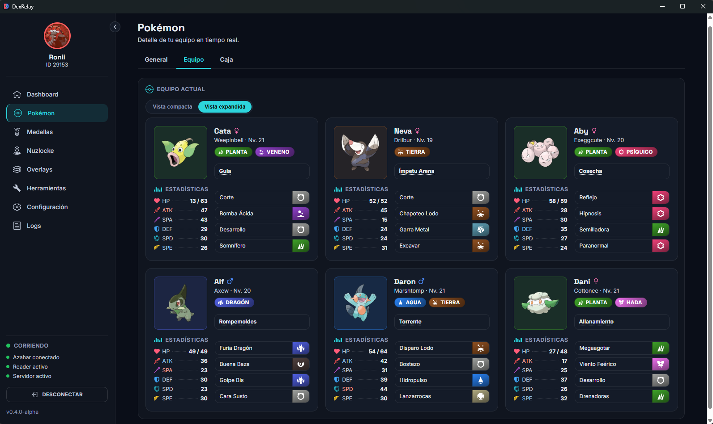
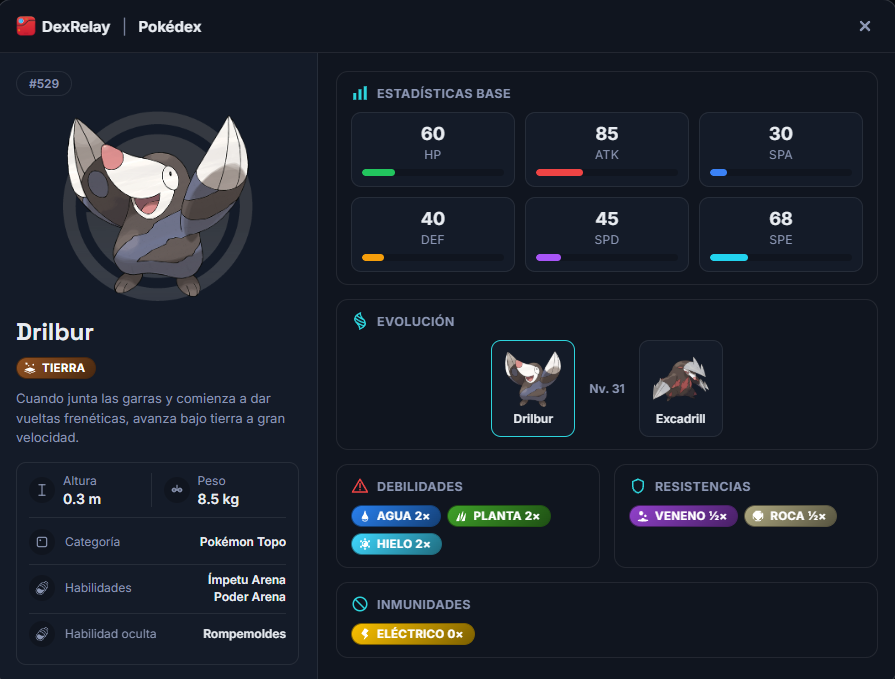
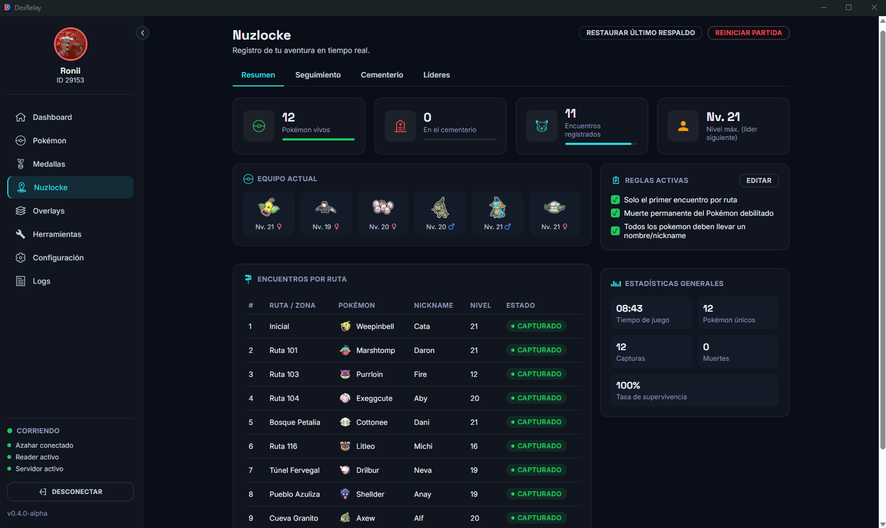
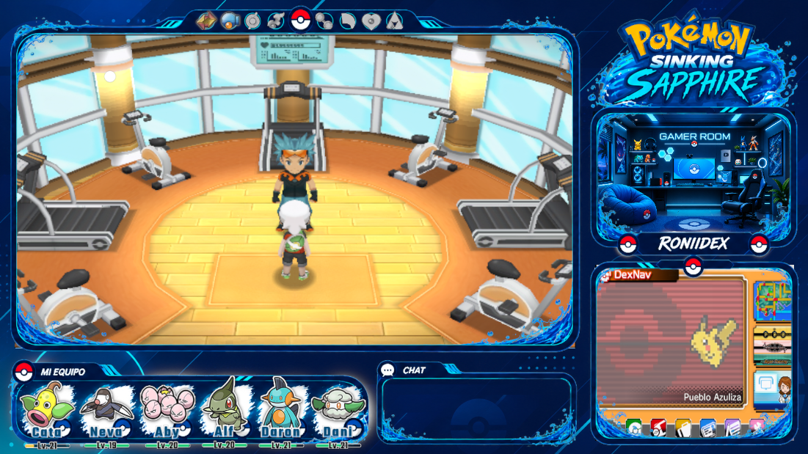

# DexRelay

  

  <strong>Tu compañero para Pokémon ORAS en Azahar</strong>

  Equipo en tiempo real · Nuzlocke · Pokédex · Medallas · OBS

  

  

---

## ¿Qué es DexRelay?

**DexRelay** es una aplicación de escritorio para partidas de **Pokémon Omega Ruby y Alpha Sapphire (ORAS)** ejecutadas en **Azahar**.

Lee los datos de la partida en tiempo real y los convierte en información útil para jugar, gestionar un Nuzlocke y transmitir tus partidas.

DexRelay integra en una sola aplicación:

- Equipo Pokémon en tiempo real.
- Información detallada de Pokémon.
- Pokédex integrada.
- Cajas Pokémon.
- Medallas y líderes de gimnasio.
- Nuzlocke Tracker.
- Overlays para OBS.
- Servidor HTTP local.
- Herramientas adicionales para la partida.

La aplicación funciona **100 % offline** y no necesita servicios externos durante su ejecución.

> **Estado actual:** v0.4.1-alpha  
> Publicada el 3 de octubre de 2026.

---

## Vista general

  

El Dashboard reúne en una sola pantalla el estado de Azahar, el lector de memoria, el Runtime, el servidor HTTP, el equipo actual, las medallas y los overlays disponibles.

---

# Funciones principales

## Pokémon en tiempo real

DexRelay detecta automáticamente el juego conectado a Azahar y muestra el equipo actual.

  

Para cada Pokémon puedes consultar información como:

- Nombre y apodo.
- Nivel.
- Género.
- Tipo o tipos.
- Habilidad.
- Movimientos.
- HP actual y máximo.
- Estadísticas.
- Información detallada del Pokémon.

También puedes consultar las primeras **7 cajas** del PC.

---

## Pokédex integrada

DexRelay incluye una Pokédex integrada con información detallada de las especies.

  

La ficha de cada especie puede mostrar:

- Tipo.
- Estadísticas base.
- Habilidades.
- Habilidad oculta.
- Altura y peso.
- Categoría.
- Evoluciones.
- Evoluciones ramificadas.
- Debilidades.
- Resistencias.
- Inmunidades.

---

## Medallas y líderes de gimnasio

Consulta el progreso de las 8 medallas de Hoenn y la información de los líderes.

DexRelay muestra:

- Medallas obtenidas y pendientes.
- Líder correspondiente.
- Ciudad.
- Tipo de gimnasio.
- Equipo del líder.
- Información específica para Rising Ruby / Sinking Sapphire cuando el modo hackrom está activado.

---

# Nuzlocke Tracker

DexRelay incluye un tracker de Nuzlocke integrado con la partida.

  

El tracker permite gestionar:

- Primer encuentro por ruta.
- Capturas detectadas automáticamente.
- Pokémon vivos.
- Cementerio.
- Encuentros perdidos.
- Reglas de la partida.
- Nivel máximo del siguiente líder.
- Estadísticas generales.
- Tiempo de juego.
- Seguimiento de rutas y zonas.

El sistema también puede detectar automáticamente encuentros que terminan sin captura y dejarlos registrados para revisión cuando la información disponible no permite resolverlos completamente.

---

# Overlays para OBS

DexRelay incluye overlays compatibles con **OBS Browser Source**.

Puedes utilizar:

### Team Overlay

Muestra el equipo actual con sprites, nombres, niveles y estado.

**Tamaño recomendado:** 1170 × 210

### Badges Overlay

Muestra el progreso de las medallas.

**Tamaño recomendado:** 656 × 100

### Nuzlocke Overlay

Muestra información del progreso de la partida Nuzlocke.

**Tamaño recomendado:** 376 × 270

Las URLs se generan automáticamente dentro de DexRelay y pueden copiarse desde la página **Overlays**.

---

## DexRelay para streams

  

Los overlays están pensados para integrarse directamente en tus escenas de OBS y mostrar información de la partida sin tener que actualizarla manualmente.

---

# Rising Ruby / Sinking Sapphire

DexRelay incluye soporte opcional para los hackroms:

- **Rising Ruby**
- **Sinking Sapphire**

El modo hackrom está desactivado por defecto y puede activarse desde **Configuración**.

Cuando está activo, DexRelay puede utilizar los datos específicos del hackrom para:

- Líderes de gimnasio.
- Equipos de líderes.
- Cambios de tipo.
- Cambios de habilidades.
- Cambios de estadísticas base.
- Cambios de movimientos.
- Evoluciones modificadas.

---

# Requisitos

## Sistema

- Windows 10/11 de 64 bits.
- Microsoft Edge WebView2 Runtime.
- Azahar con el juego cargado.

## Juego

Actualmente DexRelay soporta:

- Pokémon Omega Ruby — actualización **1.4**.
- Pokémon Alpha Sapphire — actualización **1.4**.

> Las direcciones de memoria utilizadas por DexRelay corresponden a estas versiones exactas del juego. El juego base sin la actualización 1.4 no está soportado.

## .NET

No necesitas instalar .NET para utilizar la versión publicada.

El bridge de PKHeX utilizado por DexRelay está incluido en el release como ejecutable autocontenido.

---

# Instalación

## 1. Descargar DexRelay

Descarga:

**DexRelay v0.4.1-alpha**

Archivo:

`DexRelay-v0.4.1-alpha-win-x64.zip`

## 2. Extraer

Descomprime el archivo en una carpeta donde tengas permisos de escritura.

DexRelay guarda determinados datos de progreso dentro de su carpeta `data/`.

## 3. Ejecutar

Abre:

`DexRelay.exe`

## 4. Iniciar Azahar

Abre Azahar y carga Pokémon Omega Ruby o Alpha Sapphire.

DexRelay detectará automáticamente el juego compatible.

## 5. Comenzar

Pulsa **Comenzar** desde DexRelay.

Cuando la conexión sea correcta, el Dashboard mostrará:

- Azahar conectado.
- Reader activo.
- Runtime ejecutándose.
- Servidor HTTP activo.
- Equipo detectado.

---

# OBS — configuración rápida

1. Abre DexRelay.
2. Conecta Azahar.
3. Ve a **Overlays**.
4. Copia la URL del overlay que quieras utilizar.
5. En OBS añade una fuente **Navegador / Browser Source**.
6. Introduce la URL.
7. Configura el tamaño recomendado.

Las URLs locales tienen este formato:

`http://localhost:8080/overlay/team`

`http://localhost:8080/overlay/badges`

`http://localhost:8080/overlay/nuzlocke`

No necesitas publicar ningún puerto de Internet.

---

# Funcionamiento offline y privacidad

DexRelay funciona localmente en tu ordenador.

La aplicación:

- No necesita conexión a Internet para funcionar.
- No envía los datos de tu partida a servidores externos.
- Utiliza un servidor HTTP únicamente en tu propio ordenador.
- Lee la memoria de Azahar localmente.
- Utiliza datos estáticos incluidos con la aplicación.

La excepción funcional es la página **Herramientas**, donde existe una operación específica para agregar Caramelos Raros a la bolsa.

> **Importante:** esta es actualmente la única función de DexRelay que escribe en la memoria del juego. El resto de las funciones de lectura funcionan en modo de solo lectura.

---

# Herramientas

DexRelay incluye herramientas adicionales para la partida.

Actualmente se puede agregar **Caramelo Raro** a la bolsa desde la página Herramientas.

La operación:

- Requiere una conexión activa.
- Muestra una advertencia antes de ejecutarse.
- Vuelve a leer la memoria después de escribir.
- Muestra la cantidad realmente detectada.

---

# Reconexión automática

DexRelay puede volver a detectar Azahar si el emulador se cierra y vuelve a abrirse mientras DexRelay permanece abierto.

También puede detectar automáticamente si se inicia el otro juego compatible entre Omega Ruby y Alpha Sapphire.

---

# Reportar un problema

Si encuentras un error, abre un issue en GitHub.

Cuando sea posible incluye:

- Versión de DexRelay.
- Versión de Azahar.
- Juego utilizado.
- Versión del juego.
- Si utilizas Rising Ruby / Sinking Sapphire.
- Pasos para reproducir el problema.
- Qué esperabas que ocurriera.
- Qué ocurrió realmente.
- Información de la pestaña **Logs**.

Los reportes con información reproducible son especialmente útiles para mejorar DexRelay.

---

# Créditos

DexRelay utiliza:

- **PKHeX.Core** para lectura, decodificación y lógica de datos Pokémon.
- **PokéAPI** como fuente para datos que fueron curados e incorporados localmente.
- **Azahar** y su interfaz de depuración por UDP.

---

# Licencia

Consulta la información de licencia incluida en el repositorio antes de redistribuir o modificar el proyecto.

---

  <strong>DexRelay</strong>
   
  Tu compañero para Pokémon ORAS en Azahar.

